# Firmware Update (FWU) Flow — Complete Analysis
> `fwUpdate2.0` via `SlaveFlashing` | 5 Slaves | MLX81116 Bootloader

---

## 🗺️ High-Level Overview

```
ESP32 (Master)
    │
    ├──[MeLiBu Bus]──┬── Slave 1 (NAD 4)
                     ├── Slave 2 (NAD 5)
                     ├── Slave 3 (NAD 6)
                     ├── Slave 4 (NAD 7)
                     └── Slave 5 (NAD 8)
```

> **NAD 0** = Broadcast (all slaves receive)
> **NAD BC** = Broadcast (used during flash write)
> **NAD 4–8** = Individual slave addresses

---

## 📋 Command Sequence — Quick Reference

| # | BlCmd | Command | NAD | SID | Delay | Purpose |
|---|-------|---------|-----|-----|-------|---------|
| 0 | BlCmd[0] | CMD_EPM | 0 (BC) | `0x7FF` | 100ms | Enter Programming Mode |
| 1 | BlCmd[1] | CMD_GET_STATUS1 | 0 → 4–8 | `0x700` / `0xF700` | 100µs | Confirm boot mode OK |
| 2 | BlCmd[2] | CMD_UNLOCK_MEM | 0 → 4–8 | `0xe707` / `0xe708` | none | Seed/Key per slave |
| 3 | BlCmd[3] | CMD_ERASE_FLASH | 0 (BC) | `0x705` | 100µs | Erase flash |
| 4 | BlCmd[4] | CMD_GET_STATUS2 | 0 → 4–8 | `0x700` / `0xF700` | 100µs | Confirm erase OK |
| 5 | BlCmd[5] | CMD_MOVE_PTR | 0 (BC) | `0x704` | 100µs | Set write address |
| 6 | BlCmd[6] | CMD_WRITE_FLASH | NAD BC | `0x111` | 2ms/subpage | Write firmware pages |
| 7 | BlCmd[7] | CMD_CHECK_FLASH | 0 (BC) | `0x701` | 100µs + ReqBlDelay | CRC verify |
| 8 | BlCmd[8] | CMD_GET_STATUS3 | 0 → 4–8 | `0x700` / `0xF700` | 100µs | Confirm CRC OK |
| 9 | BlCmd[9] | CMD_RESET | 0 (BC) | `0xEF55` | none | Reboot to application |
| 10 | BlCmd[10] | CMD_DONE | — | — | — | End marker ✅ |

---

## 🔄 Full Sequence Diagram

```mermaid
sequenceDiagram
    participant M  as ESP32 Master
    participant BC as NAD 0 (Broadcast)
    participant S1 as Slave 1 (NAD 4)
    participant S2 as Slave 2 (NAD 5)
    participant S3 as Slave 3 (NAD 6)
    participant S4 as Slave 4 (NAD 7)
    participant S5 as Slave 5 (NAD 8)

    Note over M: fwUpdate2.0 starts via SlaveFlashing
    Note over M: S_INIT → Request DIRECT_TRANSFER schedule
    Note over M: HaltScheduler → SchedulerHaltedCallback
    Note over M: DirectTransferAccess GRANTED

    rect rgb(40, 60, 80)
        Note over M,S5: ── STAGE 1: CMD_EPM ──
        M->>BC: BlCmd[0] SID=0x7FF, NAD=0, len=10
        Note over BC: Payload: 09 FE DE AD BE EF FF 7F FF FF
        Note over M: DTxDoneCallback → 100ms delay
    end

    rect rgb(40, 80, 60)
        Note over M,S5: ── STAGE 2: CMD_GET_STATUS1 ──
        M->>BC: GetStatusCmd SID=0x700, NAD=0, len=2
        Note over M: DTxDoneCallback → 100µs delay
        M->>S1: Fetch GetStatusRsp[1] SID=0xF700, len=8
        S1-->>M: B0=00 B1=00 B2=00 B3=00 B4=00 B5=0x10 ✅
        M->>S2: Fetch GetStatusRsp[2] SID=0xF700, len=8
        S2-->>M: B0=00 B1=00 B2=00 B3=00 B4=00 B5=0x10 ✅
        M->>S3: Fetch GetStatusRsp[3] SID=0xF700, len=8
        S3-->>M: B0=00 B1=00 B2=00 B3=00 B4=00 B5=0x10 ✅
        M->>S4: Fetch GetStatusRsp[4] SID=0xF700, len=8
        S4-->>M: B0=00 B1=00 B2=00 B3=00 B4=00 B5=0x10 ✅
        M->>S5: Fetch GetStatusRsp[5] SID=0xF700, len=8
        S5-->>M: B0=00 B1=00 B2=00 B3=00 B4=00 B5=0x10 ✅
        Note over M: All 5 OK → S_CHECK_RX_DATA → Next: CMD_UNLOCK_MEM
    end

    rect rgb(80, 50, 50)
        Note over M,S5: ── STAGE 3: CMD_UNLOCK_MEM (×5 slaves) ──
        M->>BC: GetSeedCmd SID=0xe707, NAD=0, len=2
        Note over M: DTxDoneLoopedCallback → SlaveIdx:1

        M->>S1: GetSeedRsp[1] SID=0xF707, len=6
        S1-->>M: Seed = 0x12345678
        Note over M: Calculate Key for 0x12345678
        M->>S1: SecKey[1] SID=0xe708, len=6 → 0xda 0xf2 0x9f 0xe6

        M->>S2: GetSeedRsp[2] SID=0xF707, len=6
        S2-->>M: Seed = 0x12345678
        M->>S2: SecKey[2] SID=0xe708, len=6 → 0xda 0xf2 0x9f 0xe6

        M->>S3: GetSeedRsp[3] SID=0xF707, len=6
        S3-->>M: Seed = 0x12345678
        M->>S3: SecKey[3] SID=0xe708, len=6 → 0xda 0xf2 0x9f 0xe6

        M->>S4: GetSeedRsp[4] SID=0xF707, len=6
        S4-->>M: Seed = 0x12345678
        M->>S4: SecKey[4] SID=0xe708, len=6 → 0xda 0xf2 0x9f 0xe6

        M->>S5: GetSeedRsp[5] SID=0xF707, len=6
        S5-->>M: Seed = 0x12345678
        M->>S5: SecKey[5] SID=0xe708, len=6 → 0xda 0xf2 0x9f 0xe6

        Note over M: Memory UNLOCKED on all 5 slaves ✅
    end

    rect rgb(60, 40, 80)
        Note over M,S5: ── STAGE 4: CMD_ERASE_FLASH ──
        M->>BC: BlCmd[3] SID=0x705, NAD=0, len=6
        Note over BC: Payload: 05 81 24 01 81 04
        Note over M: DTxDoneCallback → 100µs delay
    end

    rect rgb(40, 80, 60)
        Note over M,S5: ── STAGE 5: CMD_GET_STATUS2 ──
        M->>BC: GetStatusCmd SID=0x700, NAD=0, len=2
        M->>S1: Fetch → B5=0x10 ✅
        M->>S2: Fetch → B5=0x10 ✅
        M->>S3: Fetch → B5=0x10 ✅
        M->>S4: Fetch → B5=0x10 ✅
        M->>S5: Fetch → B5=0x10 ✅
        Note over M: All OK → Next: CMD_MOVE_PTR
    end

    rect rgb(80, 70, 30)
        Note over M,S5: ── STAGE 6: CMD_MOVE_PTR ──
        M->>BC: BlCmd[5] SID=0x704, NAD=0, len=6
        Note over BC: Payload: 03 10 00 58 00 00 (addr=0x5800)
        Note over M: DTxDoneCallback → 100µs delay
    end

    rect rgb(30, 60, 80)
        Note over M,S5: ── STAGE 7: CMD_WRITE_FLASH (per page loop) ──
        loop For each firmware page (000, 001, 002...)
            loop 8 Subpages per page
                M->>BC: WriteFlashSubpage[n] SID=0x111, NAD BC, len=18
                Note over BC: Subpage n: offset = n×16 bytes
                Note over M: DTxDoneCallback → 2ms delay
            end
            Note over M: 8 subpages done → fetch write-status from all slaves
            M->>S1: WriteFlashStatusRsp SID=0xF111, len=6 → B5=0x10 ✅
            M->>S2: WriteFlashStatusRsp SID=0xF111, len=6 → B5=0x10 ✅
            M->>S3: WriteFlashStatusRsp SID=0xF111, len=6 → B5=0x10 ✅
            M->>S4: WriteFlashStatusRsp SID=0xF111, len=6 → B5=0x10 ✅
            M->>S5: WriteFlashStatusRsp SID=0xF111, len=6 → B5=0x10 ✅
            Note over M: Page verified ✅ → Next page
        end
    end

    rect rgb(80, 40, 60)
        Note over M,S5: ── STAGE 8: CMD_CHECK_FLASH ──
        M->>BC: BlCmd[7] SID=0x701, NAD=0, len=4
        Note over BC: Payload: 02 02 01 FF
        Note over M: 100µs delay + ReqBlDelay (slaves compute CRC)
    end

    rect rgb(40, 80, 60)
        Note over M,S5: ── STAGE 9: CMD_GET_STATUS3 ──
        M->>BC: GetStatusCmd SID=0x700, NAD=0, len=2
        M->>S1: Fetch → B5=0x10 ✅
        M->>S2: Fetch → B5=0x10 ✅
        M->>S3: Fetch → B5=0x10 ✅
        M->>S4: Fetch → B5=0x10 ✅
        M->>S5: Fetch → B5=0x10 ✅
        Note over M: CRC verified on all slaves ✅
    end

    rect rgb(40, 80, 80)
        Note over M,S5: ── STAGE 10: CMD_RESET ──
        M->>BC: BlCmd[9] SID=0xEF55, NAD=0, len=6
        Note over BC: Payload: 04 1B 7C E4 83 FF
        Note over M: No delay → progress immediately
        Note over M,S5: All slaves reboot into application firmware
    end

    Note over M: BlCmd[10] CMD_DONE reached ✅
    Note over M: Flashing procedure finished with 5 slaves flashed ✅
```



---

## 🔍 Stage-by-Stage Deep Dive

---

### STAGE 0 — Startup & Scheduler Setup

```
[FWU1] I: Stack status at S_INIT: SCHEDULER_ACTIVE
[FWU1] I: S_RQ_SCHEDULE: requesting DIRECT_TRANSFER for CMD_EPM
[FWU1] I: ReqSchedule: halting the scheduler before requesting DT
[FWU1] I: HaltScheduler issued, wait for SchedulerHalted callback
[FWU1] I: SchedulerHaltedCallback: Scheduler halted, now requesting DT
[FWU1] I: DT_AccessGrantedCallback: currSchedule=DIRECT_TRANSFER
```

**What's happening:**
- System wakes up in `S_INIT` with default scheduler running
- Default schedule cannot co-exist with Direct Transfer (DT) — must be halted first
- Only after the halt callback arrives does it request DT access
- DT access is granted → now safe to send the first bootloader command

**Schedule State Machine:**
```
SCHEDULE_DEFAULT
      │
      ▼ HaltScheduler()
SCHEDULER_HALT_REQUESTED
      │
      ▼ SchedulerHaltedCallback
DT_ACCESS_REQUESTED
      │
      ▼ DT_AccessGrantedCallback
DIRECT_TRANSFER  ← Ready to send BlCmd[0]
```

---

### STAGE 1 — BlCmd[0]: CMD_EPM (Enter Programming Mode)

```
SID    : 0x7FF
NAD    : 0 (broadcast — all 5 slaves)
Length : 10 bytes
Schedule: DIRECT_TRANSFER
```

**Payload breakdown:**
```
Byte[00] = 0x09  ← Command identifier
Byte[01] = 0xFE  ┐
Byte[02] = 0xDE  │
Byte[03] = 0xAD  │  Magic unlock sequence
Byte[04] = 0xBE  │  to enter bootloader
Byte[05] = 0xEF  │
Byte[06] = 0xFF  │
Byte[07] = 0x7F  │
Byte[08] = 0xFF  │
Byte[09] = 0xFF  ┘
```

**Timeline:**
```
Master sends CMD_EPM ──────────────────────► All 5 slaves
                                              (simultaneously)
DTxDoneCallback fires
      │
      ▼
100ms delay  ← Wait for slaves to boot into BL mode
      │
      ▼
Progress to CMD_GET_STATUS1
```

---

### STAGE 2 — BlCmd[1]: CMD_GET_STATUS1

**Purpose:** Verify all slaves are now in bootloader mode.

**Send phase (broadcast):**
```
SID    : 0x700
NAD    : 0
Length : 2 bytes
```

**Fetch phase (per slave):**
```
Slave 1 → NAD 4 → SID 0xF700 → Rx 8 bytes
Slave 2 → NAD 5 → SID 0xF700 → Rx 8 bytes
Slave 3 → NAD 6 → SID 0xF700 → Rx 8 bytes
Slave 4 → NAD 7 → SID 0xF700 → Rx 8 bytes
Slave 5 → NAD 8 → SID 0xF700 → Rx 8 bytes
```

**Response format:**
```
B0=0x00  B1=0x00  B2=0x00  B3=0x00  B4=0x00  B5=0x10
                                              ↑
                                   CheckBoootloaderStatusByte
                                   0x10 = OK ✅
```

**⚠️ Retry Logic (PEN case):**
```
If B5 = PEN (Pending) → CheckBlRspData = PEN
      │
      ▼
S_CHECK_STATUS_LAST_CMD
      │
      ▼
Repeat GetStatus until B5 = 0x10 (OK)
```
This is a poll loop — the master keeps asking until every slave is truly ready.

---

### STAGE 3 — BlCmd[2]: CMD_UNLOCK_MEM (Security Seed/Key)

**Purpose:** Each slave requires a security unlock before its flash can be modified.

**Protocol:**
```
Master sends GetSeed broadcast
      │
      ▼ (per slave, sequential)
Master fetches seed from Slave N
      │
      ▼
Master calculates key = f(seed)
      │
      ▼
Master sends key back to Slave N
      │
      ▼
Slave N memory unlocked
      │
      ▼ (repeat for next slave)
```

**Exact values seen in logs:**
```
SID for GetSeed TX  : 0xe707  (send to NAD 0)
SID for GetSeed RX  : 0xF707  (read from each slave)
SID for SendKey TX  : 0xe708  (send key to each slave)

Seed (from all slaves) : 0x12345678
Key  (sent to all)     : 0xda 0xf2 0x9f 0xe6
```

> **Note:** All 5 slaves return the **same seed** and accept the **same key**.  
> This is a fixed seed/key pair in the bootloader — not dynamic.

**Per-slave exchange:**
```
       Master                    Slave N (NAD 4–8)
         │                            │
         │──GetSeed (SID 0xe707)─────►│
         │                            │
         │◄─Seed=0x12345678──────────-│
         │                            │
         │  [compute key locally]     │
         │                            │
         │──SecKey: da f2 9f e6──────►│
         │                            │
         │              [MEM UNLOCKED]│
```

---

### STAGE 4 — BlCmd[3]: CMD_ERASE_FLASH

```
SID    : 0x705
NAD    : 0 (broadcast)
Length : 6 bytes
Schedule: DIRECT_TRANSFER
```

**Payload:**
```
Byte[00] = 0x05  ← Erase command opcode
Byte[01] = 0x81  ┐
Byte[02] = 0x24  │  Flash region descriptor
Byte[03] = 0x01  │  (start address + size)
Byte[04] = 0x81  │
Byte[05] = 0x04  ┘
```

**After TX:** 100µs delay → slaves erase flash in background

---

### STAGE 5 — BlCmd[4]: CMD_GET_STATUS2

Identical structure to CMD_GET_STATUS1.  
Confirms that flash erase completed on all 5 slaves.

```
All 5 slaves → B5=0x10 → OK ✅
```

---

### STAGE 6 — BlCmd[5]: CMD_MOVE_PTR (Set Write Address)

```
SID    : 0x704
NAD    : 0 (broadcast)
Length : 6 bytes
Schedule: DIRECT_TRANSFER
```

**Payload:**
```
Byte[00] = 0x03  ← MovePtr command opcode
Byte[01] = 0x10  ┐
Byte[02] = 0x00  │  Flash address = 0x005800
Byte[03] = 0x58  │  (little-endian encoding)
Byte[04] = 0x00  │
Byte[05] = 0x00  ┘
```

**Address decode:**
```
Bytes [01–05] = 10 00 58 00 00
                      ↑
               0x5800 = start of application firmware region
```

All 5 slaves set their internal write pointer to `0x5800`.

---

### STAGE 7 — BlCmd[6]: CMD_WRITE_FLASH (Main Flash Loop)

This is the **most complex** stage. It loops over every page of firmware.

**Page structure:**
```
1 Page = 8 Subpages × 16 bytes data = 128 bytes total
Each subpage PDU = 18 bytes (2 header + 16 data)
```

**Subpage offsets within a page:**
```
Subpage 0 → offset   0
Subpage 1 → offset  16
Subpage 2 → offset  32
Subpage 3 → offset  48
Subpage 4 → offset  64
Subpage 5 → offset  80
Subpage 6 → offset  96
Subpage 7 → offset 112
```

**Write sequence per page:**
```
  ┌─────────────────────────────────────────┐
  │  start WriteFlash for page 000          │
  │                                         │
  │  send Subpage[0]  SID=0x111  NAD BC     │
  │       ↓ 2ms delay                       │
  │  send Subpage[1]  SID=0x111  NAD BC     │
  │       ↓ 2ms delay                       │
  │  send Subpage[2]  SID=0x111  NAD BC     │
  │       ↓ 2ms delay                       │
  │  send Subpage[3]  SID=0x111  NAD BC     │
  │       ↓ 2ms delay                       │
  │  send Subpage[4]  SID=0x111  NAD BC     │
  │       ↓ 2ms delay                       │
  │  send Subpage[5]  SID=0x111  NAD BC     │
  │       ↓ 2ms delay                       │
  │  send Subpage[6]  SID=0x111  NAD BC     │
  │       ↓ 2ms delay                       │
  │  send Subpage[7]  SID=0x111  NAD BC     │
  │       ↓ 2ms delay                       │
  │                                         │
  │  "8 subpages done, fetching responses"  │
  │                                         │
  │  fetch WriteFlashStatusRsp from NAD 4   │
  │  fetch WriteFlashStatusRsp from NAD 5   │
  │  fetch WriteFlashStatusRsp from NAD 6   │
  │  fetch WriteFlashStatusRsp from NAD 7   │
  │  fetch WriteFlashStatusRsp from NAD 8   │
  │                                         │
  │  all 5 → B5=0x10 ✅                     │
  │                                         │
  │  → next page (001, 002 ...)             │
  └─────────────────────────────────────────┘
```

**Status response per slave:**
```
SID    : 0xF111
Length : 6 bytes
Slave N (page 000) → B5=0x10 → write OK ✅
```

**Schedule switching:**
```
During subpage TX  : DIRECT_TRANSFER_LOOPED  (looped broadcast)
After all subpages : switch back to DIRECT_TRANSFER for status fetch
```

---

### STAGE 8 — BlCmd[7]: CMD_CHECK_FLASH (CRC Verify)

```
SID    : 0x701
NAD    : 0 (broadcast)
Length : 4 bytes
Schedule: DIRECT_TRANSFER
```

**Payload:**
```
Byte[00] = 0x02  ← CheckFlash opcode
Byte[01] = 0x02  ┐
Byte[02] = 0x01  │  CRC region parameters
Byte[03] = 0xFF  ┘
```

**After TX:**
```
100µs delay
    │
    ▼
ReqBlDelay fires
    │  (slaves internally computing CRC over written firmware)
    ▼
Proceed to CMD_GET_STATUS3
```

---

### STAGE 9 — BlCmd[8]: CMD_GET_STATUS3

Same polling pattern as STATUS1 and STATUS2.  
Confirms CRC check passed on all slaves.

```
All 5 slaves → B5=0x10 → CRC OK ✅
```

---

### STAGE 10 — BlCmd[9]: CMD_RESET (Reboot to Application)

```
SID    : 0xEF55
NAD    : 0 (broadcast)
Length : 6 bytes
Schedule: DIRECT_TRANSFER
```

**Payload:**
```
Byte[00] = 0x04  ← Reset opcode
Byte[01] = 0x1B  ┐
Byte[02] = 0x7C  │  Reset magic sequence
Byte[03] = 0xE4  │  (exits bootloader safely)
Byte[04] = 0x83  │
Byte[05] = 0xFF  ┘
```

**No delay after TX** — slaves reboot immediately into the newly flashed application firmware.

---

### STAGE 11 — CMD_DONE ✅

```
S_PROGRESS_NEXT_CMD_OR_PAGE → has reached last BlCmd[10] CMD_DONE
Flashing procedure finished with 5 slaves flashed
Flashing procedure finished successfully at BlCmd[10] CMD_DONE
```

---

## 📊 Schedule Type Explained

| Schedule | What it means |
|---|---|
| `SCHEDULE_DEFAULT` | Normal LIN/MeLiBu bus schedule (periodic frames) |
| `DIRECT_TRANSFER` | One-shot: master sends one frame, then done |
| `DIRECT_TRANSFER_LOOPED` | Looped: master keeps sending frames (used for polling all slaves or multi-subpage writes) |

**Transitions during FWU:**
```
SCHEDULE_DEFAULT
    │ HaltScheduler()
    ▼
DIRECT_TRANSFER          ← CMD_EPM, CMD_ERASE, CMD_MOVE_PTR, CMD_CHECK_FLASH, CMD_RESET
    │ or
DIRECT_TRANSFER_LOOPED   ← CMD_GET_STATUS (polling all 5), CMD_WRITE_FLASH (8 subpages)
```

---

## 🧠 Key Concepts Summary

| Concept | Detail |
|---|---|
| **NAD** | Node Address — uniquely identifies each slave on the bus |
| **SID** | Service Identifier — identifies the type of PDU being sent |
| **PDU** | Protocol Data Unit — the actual data packet |
| **BlCmd[N]** | Bootloader Command index N — ordered steps of the FWU sequence |
| **B5=0x10** | Status byte 5 value `0x10` = slave responded OK |
| **B5=PEN** | Pending — slave not ready yet, master must retry |
| **Seed/Key** | Security mechanism — slave issues a challenge (seed), master must respond with correct key |
| **Page** | 128 bytes of firmware data (8 subpages × 16 bytes) |
| **Subpage** | 18-byte PDU (2 header + 16 firmware bytes) |
| **ReqBlDelay** | Explicit delay requested after CMD_CHECK_FLASH to give slaves time to compute CRC |
| **callCounter** | Counts retry attempts on status checks |

---

## ⏱️ Timing Summary

```
CMD_EPM          → 100ms   (slaves need time to boot into BL)
CMD_GET_STATUS   → 100µs   (minimal, response fetched right after)
CMD_ERASE_FLASH  → 100µs   (erase runs in BG on slave side)
CMD_MOVE_PTR     → 100µs
CMD_WRITE_FLASH  → 2ms per subpage (= 16ms per page minimum)
CMD_CHECK_FLASH  → 100µs + ReqBlDelay (CRC compute time on slave)
CMD_RESET        → none
```

---

*Generated from AutoAdddrV2_DebugPrints.txt — 08/06/2026*
