# Firmware Update (FWU) Flow — Complete Analysis
> `fwUpdate2.0` via `SlaveFlashing` | 5 Slaves | MLX81116 Bootloader

---

## 🗺️ Bus Topology

```
ESP32 (Master)
    │
    └──[MeLiBu Bus]──┬── Slave 1 (NAD 4)
                     ├── Slave 2 (NAD 5)
                     ├── Slave 3 (NAD 6)
                     ├── Slave 4 (NAD 7)
                     └── Slave 5 (NAD 8)

NAD 0  = Broadcast (all slaves receive simultaneously)
NAD BC = Broadcast (used specifically during flash write)
NAD 4–8 = Individual slave addresses
```

---

## 📋 Command Sequence — Quick Reference

| # | BlCmd | Command | NAD | SID | Delay | Purpose |
|---|-------|---------|-----|-----|-------|---------|
| 0 | BlCmd[0] | CMD_EPM | 0 (BC) | `0x7FF` | 100ms | Enter Programming Mode |
| 1 | BlCmd[1] | CMD_GET_STATUS1 | 0 → 4–8 | `0x700` / `0xF700` | 100µs | Confirm boot mode OK |
| 2 | BlCmd[2] | CMD_UNLOCK_MEM | 0 → 4–8 | `0xe707/0xe708` | none | Seed/Key per slave |
| 3 | BlCmd[3] | CMD_ERASE_FLASH | 0 (BC) | `0x705` | 100µs | Erase flash |
| 4 | BlCmd[4] | CMD_GET_STATUS2 | 0 → 4–8 | `0x700` / `0xF700` | 100µs | Confirm erase OK |
| 5 | BlCmd[5] | CMD_MOVE_PTR | 0 (BC) | `0x704` | 100µs | Set write address 0x5800 |
| 6 | BlCmd[6] | CMD_WRITE_FLASH | NAD BC | `0x111` | 2ms/subpage | Write firmware pages |
| 7 | BlCmd[7] | CMD_CHECK_FLASH | 0 (BC) | `0x701` | 100µs + delay | CRC verify |
| 8 | BlCmd[8] | CMD_GET_STATUS3 | 0 → 4–8 | `0x700` / `0xF700` | 100µs | Confirm CRC OK |
| 9 | BlCmd[9] | CMD_RESET | 0 (BC) | `0xEF55` | none | Reboot to application |
| 10 | BlCmd[10] | CMD_DONE | — | — | — | End marker ✅ |

---

## STAGE 0 — Startup and Scheduler Setup

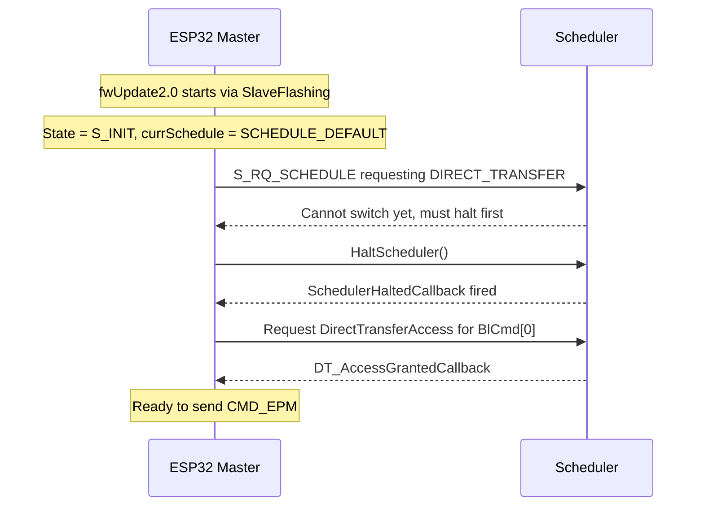

---

## STAGE 1 — BlCmd[0]: CMD_EPM (Enter Programming Mode)

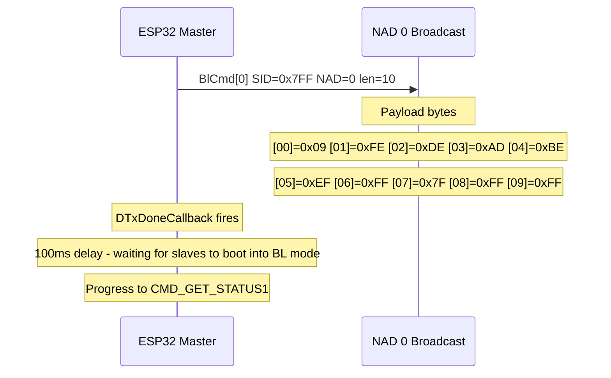

> **What this does:** Sends a magic 10-byte sequence to all 5 slaves simultaneously.
> The payload is the bootloader entry key — slaves recognize it and switch from
> application mode into bootloader (programming) mode.

---

## STAGE 2 — BlCmd[1]: CMD_GET_STATUS1 (Verify Boot Mode)

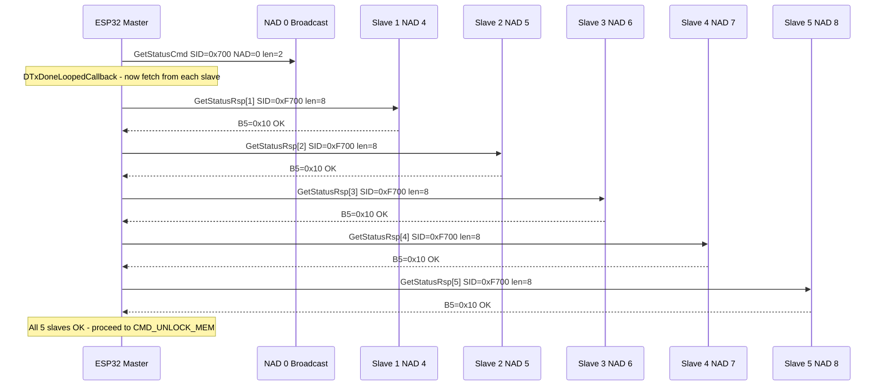

> **Response format:** `B0=0x00 B1=0x00 B2=0x00 B3=0x00 B4=0x00 B5=0x10`
> Only B5 matters — `0x10` = OK. If B5 = PEN (Pending), master retries in a loop until all slaves are ready.

---

## STAGE 3 — BlCmd[2]: CMD_UNLOCK_MEM (Security Seed/Key)

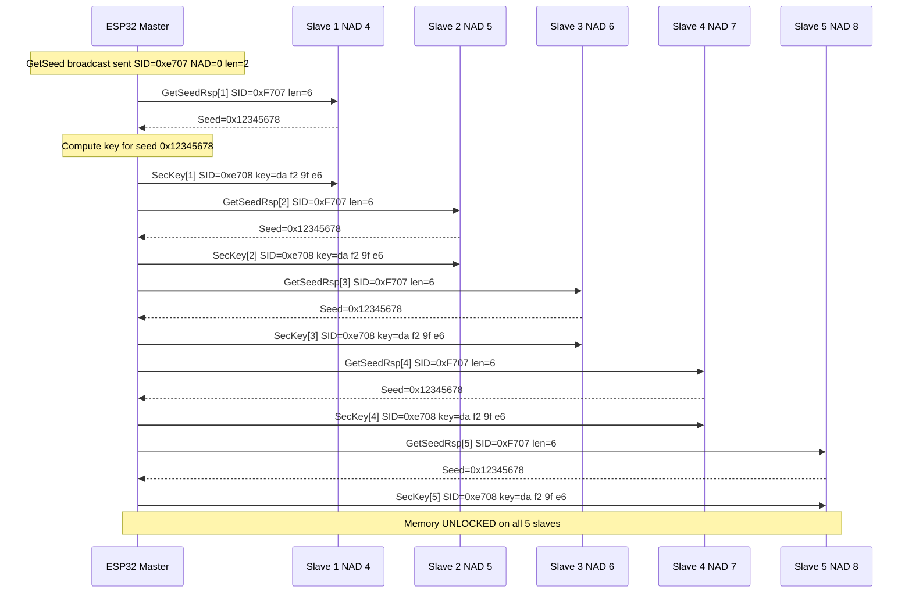

> **Seed:** `0x12345678` (same from all slaves — fixed in bootloader)
> **Key:** `0xda 0xf2 0x9f 0xe6` (same for all — derived from fixed seed)
> Done slave-by-slave sequentially, not broadcast.

---

## STAGE 4 — BlCmd[3]: CMD_ERASE_FLASH

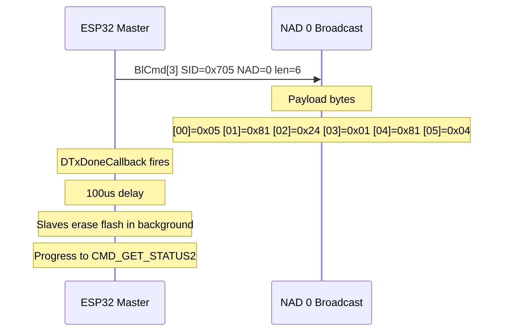

> **Payload:** Encodes the flash region to erase (start address + size descriptor).
> All 5 slaves erase simultaneously on receipt of this broadcast.

---

## STAGE 5 — BlCmd[4]: CMD_GET_STATUS2 (Confirm Erase OK)

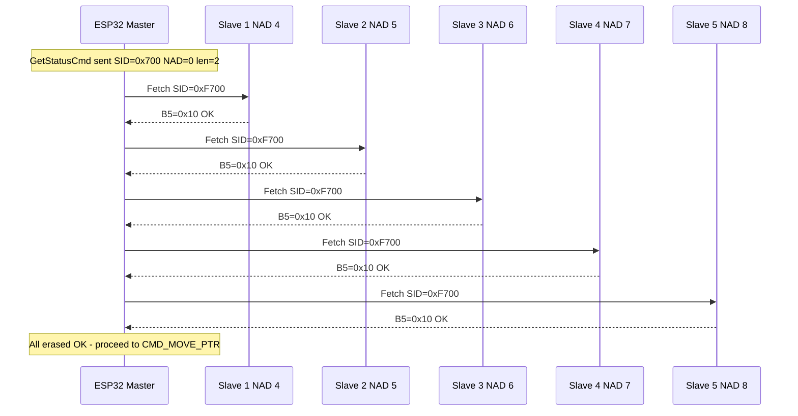

---

## STAGE 6 — BlCmd[5]: CMD_MOVE_PTR (Set Flash Write Address)

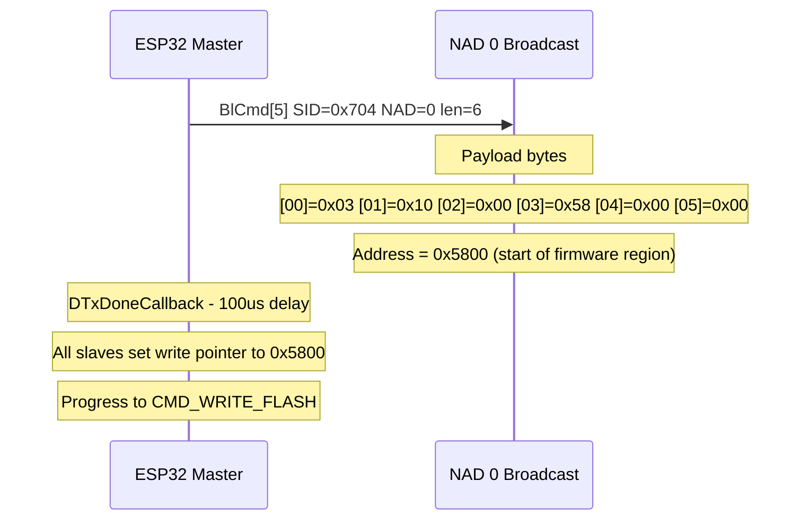

> **Address decode:** Bytes [01–05] = `10 00 58 00 00` → little-endian → `0x005800`
> This is where the application firmware starts in flash memory.

---

## STAGE 7 — BlCmd[6]: CMD_WRITE_FLASH (Main Flash Loop)

### Page Structure

```
1 Page = 8 Subpages x 16 bytes = 128 bytes of firmware data
Each subpage PDU = 18 bytes (2 header + 16 data)

Subpage 0 → offset   0
Subpage 1 → offset  16
Subpage 2 → offset  32
Subpage 3 → offset  48
Subpage 4 → offset  64
Subpage 5 → offset  80
Subpage 6 → offset  96
Subpage 7 → offset 112
```

### Write + Verify Loop (repeats for every page)

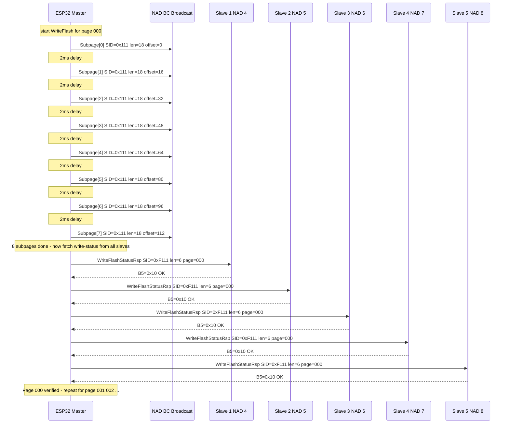

---

## STAGE 8 — BlCmd[7]: CMD_CHECK_FLASH (CRC Integrity Verify)

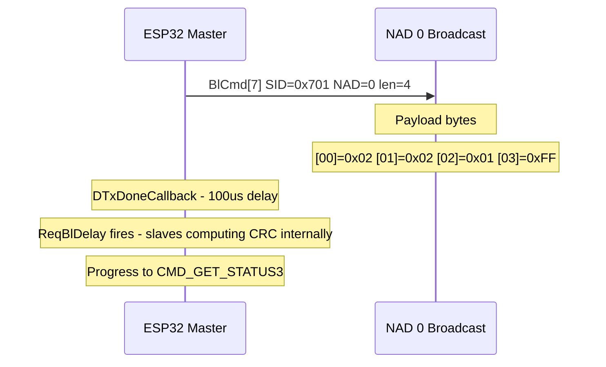

> **What this does:** Commands all slaves to compute a CRC checksum over the written firmware.
> The `ReqBlDelay` gives slaves enough time to finish the CRC calculation before the master polls.

---

## STAGE 9 — BlCmd[8]: CMD_GET_STATUS3 (Confirm CRC OK)

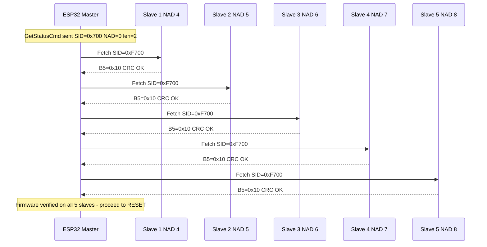

---

## STAGE 10 — BlCmd[9]: CMD_RESET (Reboot to Application)

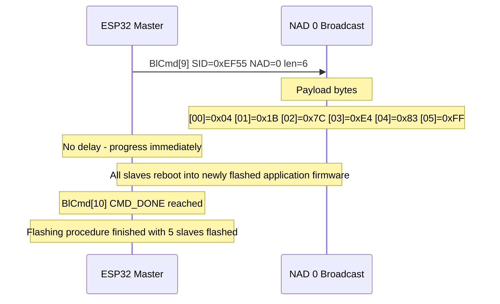

> **Payload:** Reset magic sequence — slaves exit bootloader and jump to application start address.

---

## ⏱️ Timing Summary

| Command | Delay After TX | Reason |
|---------|---------------|--------|
| CMD_EPM | **100ms** | Slaves need time to fully boot into BL mode |
| CMD_GET_STATUS | **100µs** | Minimal — response fetched immediately after |
| CMD_ERASE_FLASH | **100µs** | Erase runs in background on slave side |
| CMD_MOVE_PTR | **100µs** | Pointer set instantly |
| CMD_WRITE_FLASH | **2ms per subpage** | Flash write time per 16-byte chunk |
| CMD_CHECK_FLASH | **100µs + ReqBlDelay** | Slaves need time to compute CRC |
| CMD_RESET | **none** | Immediate reboot |

---

## 🧠 Key Terms

| Term | Meaning |
|------|---------|
| **NAD** | Node Address — unique ID of each slave on the bus |
| **SID** | Service Identifier — type of PDU being sent |
| **PDU** | Protocol Data Unit — the actual data packet |
| **BlCmd[N]** | Bootloader Command index N — ordered FWU steps |
| **B5=0x10** | Status byte value meaning slave responded OK |
| **B5=PEN** | Pending — slave not ready, master must retry |
| **Seed/Key** | Security challenge-response to unlock flash |
| **Page** | 128 bytes of firmware (8 subpages x 16 bytes) |
| **Subpage** | 18-byte PDU = 2 header + 16 firmware bytes |
| **ReqBlDelay** | Explicit wait for slave to finish CRC computation |
| **DIRECT_TRANSFER** | One-shot schedule: master sends one frame |
| **DIRECT_TRANSFER_LOOPED** | Looped schedule: used for multi-slave polling and subpage writes |

---

*Generated from AutoAdddrV2_DebugPrints.txt — 08/06/2026*
